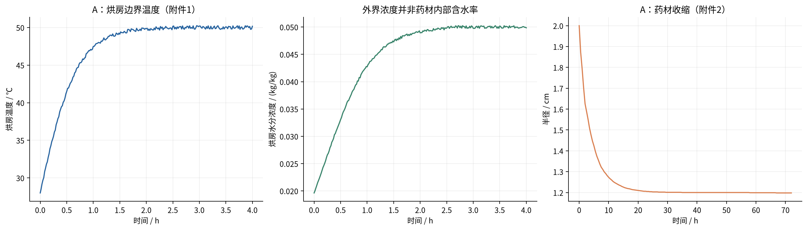
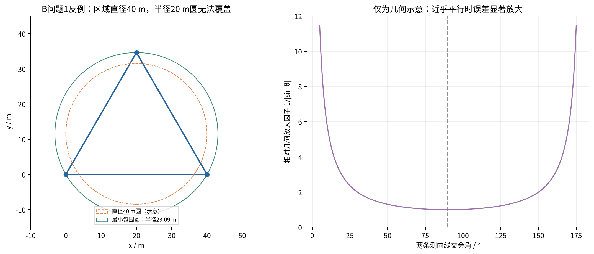
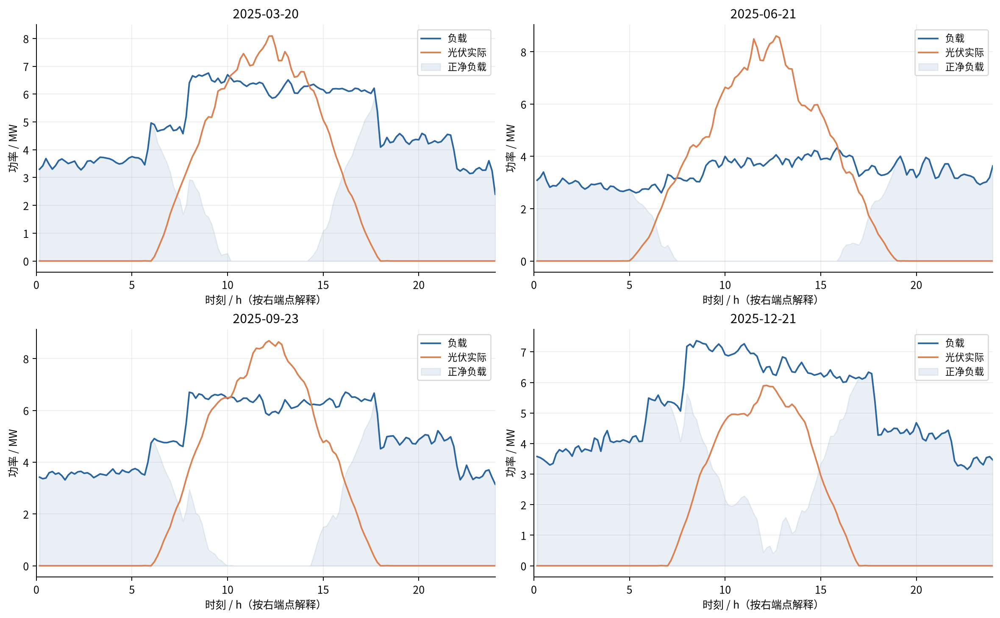
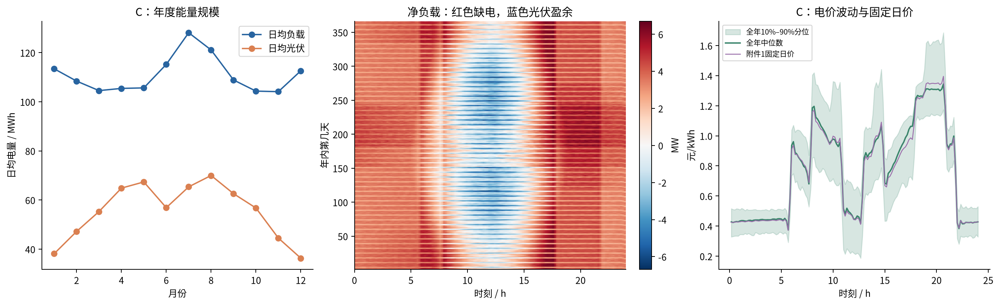
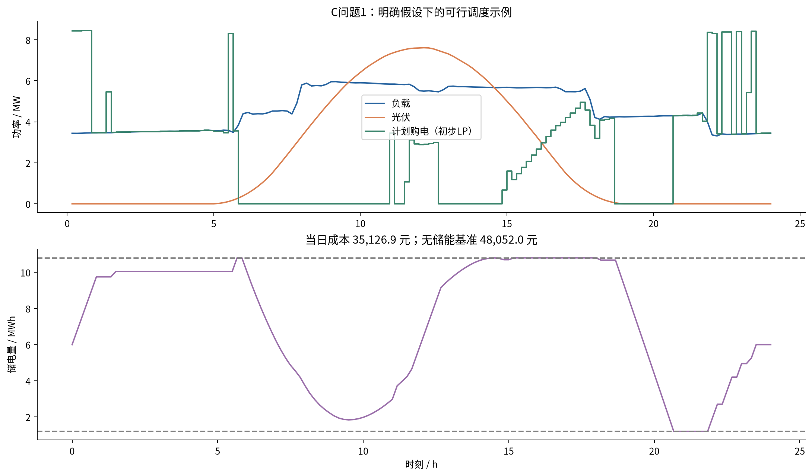
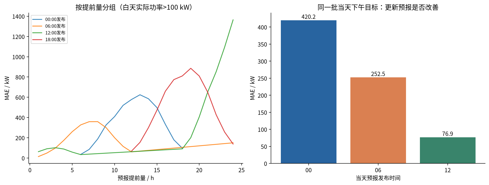
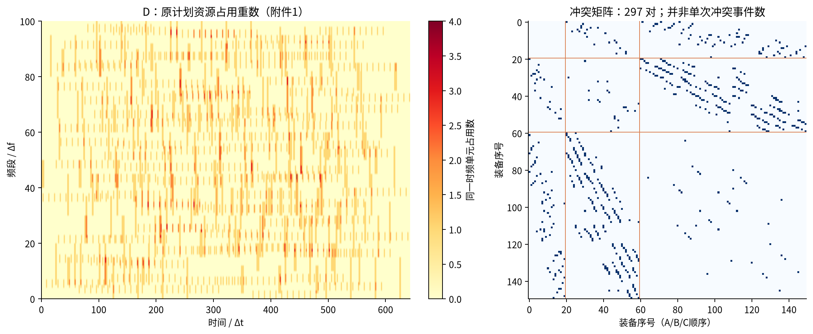
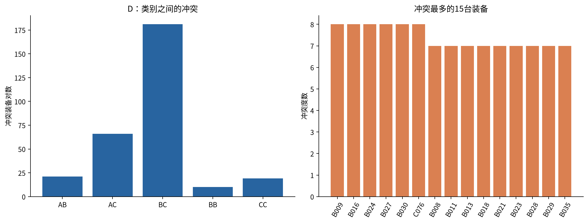

# A—D 题内容、难点与选题建议

面向：本科组、数学专业团队｜依据：本目录题面与附件｜分析日期：2026-09-10

## 1. 先给你们的选题结论

**在目前只知道“本科、数学专业”，尚不清楚数值计算与工程编程经验的情况下，默认推荐 C，A 是非常接近的第二选择，B 放在第三位。若队内有人做过偏微分方程数值求解，A 可以升为首选。** D 按你们要求完整分析，但作为跨组题型参照，不纳入本科组的实际推荐序列。2026 年高校参赛通知明确说明本科组选 A、B、C，高职高专组选 D、E，参见文末来源。

推荐 C 的理由不是它“数学少”或“最简单”，而是它的核心能落到线性规划、随机优化、滚动控制与统计验证，数学专业容易建立清楚的目标、约束和基准；我已用附件跑通第一问的一个可行优化示例，后续工作可以在同一调度框架上逐层增加。它的主要风险是信息泄露、时间对齐和费用口径，而不是数据体量大到无法计算。

A 的数学主线更集中，四问共用热质传递求解器，论文也容易形成完整推导。真正的门槛是：能否把边界条件、非线性扩散、干基含水率和收缩后的守恒关系写对，并给出可靠的数值解。只学过微分方程理论，不能直接等同于会做这道题。

B 的前两问很适合几何与优化能力强的同学，但第三、四问是带未知目标数、未知接收半径、方向性遮蔽和有限正式测试机会的在线算法系统。数学推导之外，还需要可靠的程序状态管理、覆盖保证、接口联调与日志交付；目前没有队伍工程经验的信息，不建议默认选它。

### 1.1 四题一览

| 维度 | A：药材烘干 | B：干扰源定位清除 | C：微网电力调控 | D：时频冲突消解 |
|---|---|---|---|---|
| 核心数学 | 非线性抛物型方程、移动区域、数值分析 | 计算几何、集合估计、覆盖与路径规划 | 线性/随机优化、时序预测、滚动控制 | 区间运算、冲突图、整数规划、周期排程 |
| 四问递进 | 固定参数 → 变参数 → 达标时间 → 收缩 | 几何 → 测点选择 → 全向在线搜索 → 混合方向搜索 | 确定性 → 不确定性 → 预报更新 → 电价波动 | 检测 → 消解 → 增容 → 增加可调参数 |
| 入门结果 | 温度与含水率曲线 | 几何定位区域 | 单日可行储能调度 | 全部冲突装备对 |
| 最难之处 | 第四问的坐标与守恒一致性 | 全清除保证及第四问的方向性盲区 | 信息集、结算口径与全年闭环评估 | 第二至四问的组合搜索及增容边界 |
| 对数学专业的优势 | 推导集中，误差分析容易体现训练 | 几何证明和策略设计有发挥空间 | 约束、对偶、误差与决策价值可结合 | 离散结构和优化界限清晰 |
| 交付风险 | 数值结果看似平滑但方程/边界有误 | 程序联调与正式测试不可替代 | 表格众多、跨日状态和时段容易错 | 可行方案容易，证明“最多”困难 |
| 对你们的推荐 | 有 PDE 数值经验时首选 | 有成熟编程主力时再考虑 | 默认首选 | 仅作题型参照 |

### 1.2 难度分解：不要只看总难度

下表是选题判断，1 为低、5 为高，不是官方评分、实际工时或获奖概率。数据整理难度与数学难度是不同维度，不作简单加权求和。

| 题目 | 数学建模 | 数值/算法实现 | 数据整理 | 全题验证与交付 | 主要不确定性 |
|---|---:|---:|---:|---:|---|
| A | 5 | 4 | 2 | 4 | 物理口径、移动边界、长期外推 |
| B | 4 | 5 | 2 | 5 | 探索策略、停止条件、外部模拟器 |
| C | 4 | 4 | 4 | 4 | 可用信息、费用规则、预报跨日对齐 |
| D | 4 | 4 | 2 | 4 | 多目标优先级、增容时域、“最多”的证明 |

## 2. 已经检查和计算了什么

逐一阅读了 A、B、C、D 题面，B 的两份 DOCX 接口说明，以及 A、C、D 的全部数据表和结果模板。没有分析 E，也没有修改原始题面和附件。

本报告中的结果分为三种，使用时请区分：

1. **附件实算**：数据规模、范围、A 的收缩比例、C 的能量与预报误差、D 的冲突统计。可以由附带脚本复算。
2. **明确假设下的试算**：C 第一问的单日线性规划；D 仅允许撤销、忽略类别优先级的受限问题。用于判断可行性与难度，不是四题完整解答。
3. **推导和构造示意**：B 的几何反例与误差放大图，没有伪造干扰源真实位置、模拟器成绩或正式测试日志。

### 2.1 附件规模

| 题目 | 数据内容 | 实际规模 | 对工作量的意义 |
|---|---|---|---|
| A 附件1 | 烘房温度、水分浓度 | 241 个时间点，0–4 h，间隔 60 s | 长期干燥需要明确 4 h 后的边界延拓 |
| A 附件2 | 药材半径 | 145 个时间点，0–72 h，间隔 1800 s | 第四问给出了几何收缩轨迹，不需盲目自拟收缩规律 |
| B 附件 | 操作说明、HTTP+JSON 协议 | 2 份 DOCX，无目标坐标样本表 | 可画几何示意，但实际策略成绩必须来自模拟器 |
| C 附件1 | 单日价格、负载、光伏预测 | 144 个 10 min 时点 | 第一问可形成小规模优化问题 |
| C 附件2、4 | 全年负载、实际光伏、实时电价 | 每个序列 365×144＝52,560 个值 | 普通计算机足够；主要工作在时间与业务逻辑 |
| C 附件3 | 每天四次、未来24 h光伏预报 | 1460 行、35,040 个预报值 | 必须按“发布时间＋提前量”建立目标时间 |
| C 结果模板 | 二至四问评估区间 | 2月1日至12月31日，共334天 | 1月可作预热/训练，但仍需处理储能状态 |
| D 附件1 | 三类周期性用频计划 | 150 台装备、展开后1300次使用 | 冲突检测容易，移动后的重新冲突才是优化负担 |

A 的数值数据与 C 的负载、实际光伏、电价矩阵均未发现数值缺失。C 预报表的日期列存在空字符串，需要向下填充；这属于表格表示方式，不应当删除对应预报行。结果模板中的空白和省略号是待填占位，不能当作输入缺失值处理。

## 3. A题：药材的烘干问题

### 3.1 题目究竟要求什么

把长 25 cm、初始半径 2 cm 的圆柱形药材放入随时间升温、增湿的烘房，计算内部不同半径位置的温度与干基含水率。前两问得到时空演化，第三问找全体位置都达标的时刻，第四问加入收缩。它不是用附件直接拟合“含水率随时间下降”的回归题，因为附件没有内部含水率观测。

| 问题 | 核心任务 | 建议主方法 | 难点与应交结果 |
|---|---|---|---|
| 1 | 预热平衡阶段，1800 s 内温度和含水率 | 一维径向导热/扩散＋对流边界＋数值离散 | 水分扩散系数已随 C 变化；需按1 s、0.1 cm输出并给指定表格 |
| 2 | 采用附录3经验式，建立全过程模型并展示前三小时 | 随 C、T 变化的非线性方程组 | 摄氏度与开尔文转换、变量系数通量、阶段表述与参数口径 |
| 3 | 所有位置 C＜0.15 kg/kg 所需时间 | 第二问模型长时间积分＋阈值事件定位 | 不能以平均含水率或表面含水率代替最慢位置 |
| 4 | 附件半径轨迹＋附录4参数下的干燥时长 | 固定参考坐标/移动网格＋一致的物质守恒 | 收缩足够大；输出实际距离与表面位置随时间改变 |

### 3.2 附件图揭示的实际难点



烘房温度从 28 ℃上升到约 50 ℃，水分浓度从 0.01963 上升到约 0.05 kg/kg。附件末一小时的均值分别为 49.9989 ℃和 0.0499875 kg/kg，因此“4 h 后按末段稳定均值保持恒定”是有数据依据的工作假设；题面没有提供 4 h 后的实测环境，不能把这一延拓写成已知事实。

半径从 2.000 cm 下降到 1.198 cm，缩小 **40.1%**；如果长度不变，横截面积与体积仅剩初始的 **35.88%**。附件半径没有回升点，可以优先采用分段线性或保单调插值。随意用高阶多项式外推可能出现半径回升或负值。

收缩既缩短扩散路程，也改变单位体积对应的干物质量、交换面积及传递参数。不能仅凭“半径变小”断言第四问一定比第三问更快，因为第四问还更换了扩散系数等经验式。

### 3.3 一个可落地的基础模型

先明确采用“长圆柱中段、一维径向传递、忽略轴向变化”的近似。两端面积之和与侧面积之比为 R/L＝0.08，给出了忽略端面的量级理由，但不能证明端部影响处处很小。题目仅要求距中心的径向输出，此近似适合作为主模型；有余力再用二维轴对称模型检验端部影响。

固定区域下的简化控制方程可写成：

```text
ρ(C) cp(C) ∂T/∂t = (1/r) ∂[r k(C) ∂T/∂r]/∂r
∂C/∂t          = (1/r) ∂[r D(C,T) ∂C/∂r]/∂r
中心对称条件：∂T/∂r = ∂C/∂r = 0，r = 0
外边界：-k ∂T/∂r = h(T_surface - T_ambient)
        -D ∂C/∂r = hm(C_surface - C_equilibrium)
初始值：T = 28 ℃，C = 2.55 kg/kg
```

这里将水分方程写成干基含水率的有效扩散模型，必须说明所用经验 D 与该变量定义一致。外界空气的 kg/kg 和药材的“每千克干物质含水量”未必具有相同分母；若直接把附件烘房浓度当成边界平衡浓度，应明确这是题目简化下的等效驱动力假设。更物理的写法需要吸附等温线或分配关系，而本题没有提供相关标定数据。

热方程中是否引入蒸发潜热也应讲清楚：题面未提供潜热/相变源项模型，按给定参数建立不显式含潜热的基础模型具有可操作性，但不能声称已完整描述所有热质耦合机理。引入新物理项前，要有参数来源与量级验证。

变量系数必须留在散度内部。例如 D 随 C 变化时，不能未经说明把 `∇·(D∇C)` 换成 `D∇²C`；后者漏掉了系数梯度贡献。

### 3.4 第一至三问的关键技术点

**空间非均匀性有量级依据。** 第一问热扩散率约 1.6886×10⁻⁷ m²/s，初始水分扩散系数约 4.9377×10⁻⁹ m²/s。以初始半径 R 估算，热扩散时间 R²/α≈2369 s，水分扩散时间 R²/D≈22.50 h。这些是特征尺度，不是题目最终的预热或烘干时间。

以 R 为特征长度，热 Biot 数约 1.39，初始传质 Biot 数约 3.24，内部传递阻力不可随意忽略。即使用体积/侧面积 R/2 为长度，量级仍不支持直接把整个药材视作温度、浓度均匀的一个点。

**1800 s 是第一问的输出范围，不是已证明的阶段切换时刻。** 第二、三问明确统一采用附录3经验公式，不宜机械地前1800 s沿用附录2、此后才换参数。若另设阶段，需要解释与题面“统一采用”的关系。

**扩散系数中的温度必须用 K。** 附录3、4中的 `exp(-3850/T)` 对 T 非常敏感；将 50 直接代入与将 323.15 代入，会得到完全不同的扩散量级。初始、边界和输出可以用℃，计算该经验式时转换即可。

**推荐有限体积或保守差分，再做时间积分。** 圆柱中心有 `1/r` 的表观奇点，不能直接除以 r＝0。有限体积使用环形控制体和界面通量，中心零面积界面自然实现对称边界；非线性系数可用隐式迭代或方法线求解。刚性常微分方程可考虑 BDF/Radau；其适用性可参照 SciPy 官方文档。

**输出步长不等于内部求解步长。** 题目要求每1 s输出，不要求固定1 s显式积分。以1 mm径向网格计算，第一问中心附近显式热扩散稳定步长的量级约1.5 s，网格再加密会明显限制显式方案。应让求解器保证误差，再插值到输出网格。

**达标条件是最大值约束。** 令 `M(t)=max_r C(r,t)`，通过 `M(t)-0.15=0` 找阈值到达时刻，并在数值容差下取满足严格低于的时刻。中心通常较慢，但应由解的单调性或全网格检查确认。不能只每6 h查看一次后直接给出那个时刻。

### 3.5 第四问：最需要数学训练的部分

设参考坐标 `ξ=r/R(t)`，把变化区域映射到 `[0,1]`。仅对一个不含物质运动的欧拉扩散方程做变量替换，会出现如下形式：

```text
U(ξ,t) = C(R(t)ξ,t)
∂U/∂t = [1/(R(t)² ξ)] ∂[ξ D ∂U/∂ξ]/∂ξ
        + ξ R'(t)/R(t) · ∂U/∂ξ
```

但这个几何变换式**不能自动等同于收缩药材的物质守恒模型**。若假设固体骨架以 `v(r,t)=rR'(t)/R(t)` 均匀径向收缩，则物质导数中的对流项与坐标变换项会抵消；若空间干物质密度不均，还会产生密度加权通量。比较可靠的推导起点是：

```text
∂ρd/∂t + ∇·(ρd v) = 0
∂(ρd C)/∂t + ∇·(ρd C v + jw) = 0
jw = -ρd D ∇C                         （一种有效本构假设）
所以 ρd(∂C/∂t + v·∇C) = ∇·(ρd D∇C)
```

其中 ρd 为单位当前体积中的干物质质量。必须决定附录经验密度与 ρd 的关系、是否长度保持不变、收缩是否均匀。若把经验 `ρ(C)` 理解成湿材料密度，则可尝试 `ρd=ρ/(1+C)`，但它与给定半径曲线和干物质守恒是否同时相容，需要校验。不要把外部给定的 R(t)、经验密度和任意收缩速度同时当作天然自洽。

对数学专业而言，这一问最值得投入的是“模型假设—变量定义—守恒—坐标变换”的完整链条，而不是先找一个复杂求解器再套公式。

### 3.6 应做的验证与容易丢分的地方

| 检查 | 为什么必要 |
|---|---|
| 长度、半径统一换为 m，Arrhenius项温度为 K | 单位错误可让时间尺度差多个数量级 |
| 非负性、初始条件、边界通量方向 | 平滑曲线不保证物理正确 |
| 例如21/41/81个节点的网格比较 | 题目保留四位小数不等于数值误差自动达到10⁻⁴ |
| 控制体水分变化与表面通量积分的平衡 | 检查固定域和收缩模型的一致性 |
| 4 h后环境延拓、72 h后半径延拓的敏感性 | 数据范围之外是外推；若在范围内达标则不需相应外推 |
| 第四问超出当前半径的位置留空/不适用，另列真实表面 | 不能在已经不存在的药材位置填插值浓度 |

第二问文字既谈全过程，又要求前三小时展示和“完整结果”，模板没有明确最终行数。实现上保留可输出全过程的能力，至少确保前三小时1 s网格完整，并在说明中写清 result2 的时间范围。第四问应保留中心、有效的0.1 cm实际距离和表面列，不能把固定参考坐标误标成固定厘米距离。

**对你们的适配结论：** 如果有人能独立处理圆柱扩散离散、隐式迭代和误差检验，A 会是非常好的数学型选题；如果数值 PDE 完全陌生，第四问会把早期积累的优势消耗掉。

## 4. B题：无线电干扰源的快速自动定位与清除

### 4.1 题目的真实结构

目标位于半径1800 m圆域，数量10–16个但未知，分布在互不相同的20个频道中。机器狗只能停车后逐频道测向，示向误差在±1°内，同一位置重复检测不会产生新的独立误差。接收半径1000–1500 m且目标各不相同；20 m内光学清除一定成功，5 m内且在信号覆盖方向可能返回 `near`。

| 问题 | 要解决的事 | 合适的数学对象 | 主要难点 |
|---|---|---|---|
| 1 | 多次测向形成的定位区域直径，以及圆覆盖判断 | 半平面交、凸多边形、最小包围圆 | 定位直径不等于最小包围圆直径；处理退化和无界区域 |
| 2 | 已有一次测向，选第二测点 | 扇形不确定集、鲁棒测点设计 | 真位置、真距离未知，不能直接套“90°交会最优” |
| 3 | 全向源全部搜索、定位与清除 | 覆盖规划＋目标状态机＋在线路线 | 搜索发现与局部精定位相互抢占时间，停止需保证 |
| 4 | 加入未知朝向的180°定向源 | 位置—朝向联合可行集、方向覆盖 | 无信号有多种解释，普通圆覆盖不足以保证发现 |

### 4.2 前两问的数学内容

每次有效示向给出以检测点为顶点、角度为 `θ±1°` 的狭窄扇形；用两条带方向的边界射线对应半平面约束。不要把射线当作没有正反方向的整条直线。多个约束相交得到凸区域：先求可行区域顶点，再计算最远顶点对。顶点数量不大时 O(m²)枚举足够透明；需要效率时可使用凸包与旋转卡壳。

如果约束不足导致区域无界，“有限直径”并不存在。可以显式引入题目目标圆域或保守接收距离约束进行裁剪，但圆域裁剪后的边界含圆弧；使用多边形近似时要区分内接/外接近似，以免排除真实目标。若有信号，已知目标距离至多1500 m，**并不意味着至少1000 m**：1000 m是接收半径的下界。



**第一问“以定位区域直径为直径的圆能否覆盖区域”：一般不能。** 边长40 m的等边三角形区域直径为40 m，但最小包围圆半径为 `40/√3≈23.094 m`，大于20 m。图中橙色圆未覆盖顶点；更强的结论来自最小包围圆半径，而不是只检查某一个圆心。

这直接影响清除策略：`区域直径≤40 m` 不能保证存在一个20 m半径圆覆盖它；正确证书是**最小包围圆半径≤20 m**，随后移动到圆心清除。更保守地，若区域直径≤20 m，在区域内任选一个点就能覆盖全区域。

第二问中，若假定目标点已知，两条视线接近90°交会通常具有良好的角度几何；图中 `1/|sin θ|` 仅展示近乎平行时的误差放大量级。真实问题还需考虑视距、移动成本、第二点是否能接收信号，以及第一条示向带来的未知距离。

可以把第二测点候选区域定义为：与第一点有足够基线、相对当前扇形位于侧向、在候选目标位置上具有较好交会角，并满足接收可行性的一组位置。对离散候选点计算“最坏情况下定位区域大小＋移动耗时”的指标；若要求保证接收到所有可能目标，需要满足候选目标集到第二点的最大距离≤1000 m，这样的鲁棒区域可能为空，不能承诺总能一步达到理想交会。

### 4.3 第三问：可行策略应分成哪些环节

先建立全向情况下的保守搜索覆盖：以最小接收半径1000 m确保目标圆域中的任一点至少靠近某个检测站点，然后在这些点检测尚未清除、尚未排除的频道。覆盖路径应尽量短，沿途已经检测过的点和频道可以复用。

一旦发现某频道，维护该频道的目标可行区域，而非只保存两条测向线的交点。候选区域足够小则清除；否则选侧向测点缩小区域，再决定继续定位还是顺路访问其他目标。总体目标应包含移动、切台、检测、失败清除和成功清除的全部时间。

```text
总虚拟时间 = 路程/5 + 切台次数×1 + 测向次数×5
             + 清除失败次数×3 + 清除成功次数×5
```

从频道1开始在同一地点完整扫20频道，最快也需要119 s；移动1 km需要200 s。可见路径和重复扫描都会明显影响表现，仅优化三角交会算法的计算速度并不足够。

停止条件不能是“已清除10个”“很久没有新信号”或“剩余频道在原点无信号”。需要覆盖证书排除剩余频道在整个目标域内仍存在源的可能性；清除达到16个时可直接利用题目总数上界停止，其余情形仍需论证。局部加速策略与保底覆盖策略应能相互切换。

### 4.4 第四问：为什么难度明显上升

对于定向源，无信号可能来自：不存在目标、超接收半径、落在发射半平面的背面。即使一个点距离目标只有几十米，也可能没有无线电信号；光学清除则不受朝向影响。用“无信号”直接删除一个1000 m圆盘的目标可行区域，在第四问中是错误的。

需要把未知朝向一并纳入可能状态，或构造从多个方向接近目标的保底检测网络。一种足够条件的思路是：对每个可能目标位置，在1000 m内的检测站方向不能全部落入某个开放半圆，这样任何发射半平面都至少覆盖一个站点。如何在整个连续圆域上保证该条件，比普通距离覆盖复杂；仅对有限网格采样验证只能说明采样点通过。

题目明确允许机器狗走出目标圆域，因此可以在边界外布置检测点，补足边界目标朝外发射的情况。若人为规定机器狗只能在目标圆内活动，会制造不必要的不可观测问题。保底网络必须与全路径时间联合评估，不能靠无限加密测点解决效率问题。

### 4.5 接口与正式测试的实际负担

以下全部来自本地 B 附件，不是对外部模拟器运行状态的推测：

| 项目 | 题目/附件要求 | 对实现的影响 |
|---|---|---|
| 接口 | 本机HTTP，`/enter /measure /clear /exit` | 移动和切频道由参数隐式触发，不能另造接口 |
| 顺序 | 新动作必须逐个等待响应 | 不能并发发送多个行动请求 |
| 重试 | 同一动作重试复用同一request_id与原参数 | 新ID重试可能重复动作；旧ID改动作会冲突 |
| 响应 | 同时检查HTTP状态与accepted | accepted=false的virtual_time_s=0不是时钟归零 |
| 频道 | `/clear`不改变测向机当前频道 | 计费与状态更新要区分检测频道、目标频道 |
| 时间 | 25 min测试窗口，enter后至多20 min程序时间；虚拟时间上限100 h | 虚拟5 s检测不用在现实中sleep 5 s |
| 次数 | 问题3、4各3次正式测试 | 正式机会用于成熟版本；中止仍消耗机会 |
| 提交 | 三次＋三次正式日志、案例编码、统计表 | 自建仿真可以调试，但不能替代指定正式日志 |
| 联网与截止 | 全程联网；9月13日17:30后不能启动新测试，题面建议15:30前完成正式测试 | B有明确外部时间依赖，应在计划中提前留出联调与导出时间 |

当前目录只有说明文档，没有模拟器程序或目标真值文件。本次没有下载/登录模拟器、没有发出清除请求、没有消耗正式测试机会。对 B 的推荐建立在题面与协议复杂度上，不能据此声称某策略已经达到某个清除率或平均耗时。

**对你们的适配结论：** 有算法竞赛或机器人/交互系统经验的编程主力，可以考虑 B；否则前两问的数学吸引力容易掩盖后两问的工程工作量。

## 5. C题：微网与外部电网电力调控策略

### 5.1 数学结构与四问递进

微网通过光伏、外网购电与电池充放电满足负载。第一问已知一天的价格、负载与预测光伏；第二问加入负载和光伏的不确定性，缺口电按五倍价格购买；第三问可以依据更新预报修改购电计划但需支付相应费用；第四问电价也实时波动。

| 问题 | 决策时信息 | 核心模型 | 主要交付 |
|---|---|---|---|
| 1 | 附件1的确定性日曲线 | 144时段的储能优化 | 单日10 min购电量、分段充放电、日费用与首末SOC |
| 2 | 当天0:00前可获得的历史资料与当前SOC | 预测＋风险裕度/情景优化＋在线执行 | 334天日前计划、充放电与紧急购电 |
| 3 | 当天0:00及6/12/18时发布的预报 | 多阶段/滚动优化＋调整费用 | 日前计划、最终调整量、实际充放电与紧急购电 |
| 4 | 在前述条件上加入价格不确定性 | 价格预测/情景＋滚动调度 | 分别重算第二、第三问，形成两个工作簿 |

题目没有完整规定负载预测方法、未来电价的可见性以及部分调整结算细节。因此论文必须给出明确的信息集和业务解释；这不是可以通过增加一个神经网络自动解决的问题。

### 5.2 实际数据给出的直观认识



四个指定日期都呈现夜间用电而光伏为零、白天出现光伏峰值的结构，但季节性和净负载差别明显。不能只优化一个“典型日”，再将同一个计划复制到全年。



按每个时点代表相应10 min区间功率的解释，全年负载电量约 **40,524.05 MWh**，光伏约 **20,251.24 MWh**，光伏总能量约占负载的 **49.97%**。但这不等于微网有一半时刻能自给：全年有 **10,130** 个时段出现光伏大于负载，分布在 **330** 天；夜间仍需外网与电池供电。

负载范围约1995.72–7978.88 kW，实际光伏峰值10216.20 kW。电价范围0.0076–1.7936元/kWh，存在明显低价与高价时段，价格差异为储能调度提供了价值空间。

电池总容量12000 kWh，但允许区间是1200–10800 kWh，**可用储能窗口只有9600 kWh**，约为日均负载111024.81 kWh的8.65%。最大充放电功率5000 kW，每个10 min区间的电网侧充/放电量至多833.333 kWh。电池可以削峰与缓冲预测误差，无法无限吸收盈余或维持全天负载。

### 5.3 第一问可以怎样写成数学规划

令每时段长度为1/6 h；`g_t,c_t,d_t,s_t`分别为购电、充电、放电和弃电/过剩电量，单位统一为kWh；`E_t`为时段初储电量。以充放电效率各为0.9为工作解释：

```text
min  Σ p_t g_t
s.t. g_t + PV_t Δt + d_t = Load_t Δt + c_t + s_t
     E_(t+1) = E_t + 0.9 c_t - d_t/0.9
     1200 ≤ E_t ≤ 10800
     0 ≤ c_t,d_t ≤ 5000/6
     g_t,s_t ≥ 0
     E_0 = E_144 = 6000                （本次试算的解释）
```

题面只要求供电不低于负载，使用非负剩余变量把不等式写成能量平衡，避免人为加入售电收益。若允许弃电，需说明物理含义；题目未给上网卖电机制，不应自行设置负购电或售电收入。

通常还应禁止同一时段同时充放电。可用二进制变量形成混合整数线性规划，或者先求线性规划松弛，再验证是否出现同时充放电并分析为什么松弛在当前假设下合理。本次单日求解没有出现同时充放电，不能据此保证后续随机电价、不同费用模型中也一定如此。

“充放电效率为90%”也可能被理解成往返效率90%；本文试算采用两侧各90%，往返效率81%。正式解答应固定解释并对另一解释做敏感性分析，避免看似同一个SOC公式却混用不同效率定义。

### 5.4 已跑通的单日试算



采用上节模型、输入每行对应当日一个10 min区间、首末SOC均为6000 kWh，得到：

| 指标 | 附件1单日试算 |
|---|---:|
| 优化后计划购电量 | 59,482.6990 kWh |
| 优化后购电费用 | 35,126.9486 元 |
| 无储能、直接按正净负载购电费用 | 48,052.0466 元 |
| 相对上述无储能基准的费用降低 | 26.8981% |
| SOC最小/最大值 | 1200 / 10800 kWh |
| 同时充放电时段数 | 0 |
| 能量与SOC等式最大残差 | 约9.1×10⁻¹³ kWh |

这是**第一问明确假设下的初步优化结果**，说明调度问题具有清楚的收益空间和可检验性。它不代表二至四问的实际成本，也不是把真实未来数据当成已知后得出的全年策略成绩。完整试算数据保存在 `analysis/tables/C_q1_LP_probe.csv`。

### 5.5 第二问的核心不是“预测得准”，而是“在可用信息下决策”

每天0:00制作计划时，不能读取当天实际负载和光伏作为确定输入，再事后计算为零的紧急购电量。附件2中的未来真值可以用于结算和评估；对尚未发生的时段，只能采用决策时可获得的预测。建议显式定义信息集 `I_(d,0)`，程序中通过日期切片控制可见数据。

先用简单、可解释的负载与光伏预测建立基线，例如昨日/上周同日、滚动分时均值、趋势与季节特征回归，再根据历史残差构造场景或安全裕度。是否使用复杂预测器，应由滚动验证证明，而不是凭模型名字决定。

缺电按5倍价格处罚，会使“无偏均值预测”不一定对应最低费用。作为一个忽略储能和跨时耦合的单时段示例，若净需求随机为N，费用为 `p q + 5p E[(N-q)+]`，则连续分布下最优计划满足 `F_N(q)=0.8`。这个推导说明应考虑偏向防缺电的分位数；加入储能、光伏盈余和跨期状态后，不能把80%分位数逐时独立套用当成全题最优解。

真实执行还应设计SOC反馈：若白天光伏不足，电池如何补缺、何时紧急购电、是否保留晚高峰储能？计划层与执行层必须区分，否则一个“日前最优”计划可能在真实光伏下无法实施。

第二问只明确了2025年1月1日0:00电量6000 kWh，未要求每晚都回到6000。每天重置SOC会凭空生成或消失能量。1月虽然不在最终334天模板的主要输出范围内，也应通过因果调度确定2月1日的真实SOC；若采用每日循环约束作为简化，需要明确它是额外假设，评估其经济代价。

### 5.6 第三问：更新预报确有信息价值，但不一定值得每次调整



预报表中“预报1小时”是发布时间之后1 h的功率。例如1月1日18:00的“预报7小时”对应1月2日01:00，不能仍然填到1月1日07:00。按目标整点与附件实际功率配对，共得到35,004个有效配对，剩余36个目标时点落到2026年而无实际值，已从本次误差计算中剔除。

为了避免夜间大量零值稀释误差，本次以实际功率大于100 kW定义日间样本。所有24 h目标混在一起时，0/6/12/18时发布预报的日间MAE分别约为373.21、200.49、427.80、534.96 kW；**不能据此断言12时更新不如0时**，因为它们预测的目标时段与提前量不同。

进一步只比较同一天13:00–24:00、三次预报都有且实际功率大于100 kW的同一批目标，共1946个时点：

| 发布时间 | 同一批当天下午目标的MAE |
|---|---:|
| 当日00:00 | 420.22 kW |
| 当日06:00 | 252.48 kW |
| 当日12:00 | 76.90 kW |

这组对齐比较表明，较新预报对同一目标时刻有明显改善，值得作为第三问的研究依据。但是**误差下降并不自动意味着总费用下降**：若新信息只影响已被电池缓冲的波动，或者调整罚价超过避免紧急购电的收益，就不应改计划。报告与代码应比较“始终不调整”“每次都重优化”“触发阈值调整”等策略的实际结算成本。

以上误差图使用全年事后真值，是选题阶段的描述性分析。正式回测时，不应利用全年统计反过来为年初计划选择阈值；阈值和误差分布必须只由当时历史资料估计。

### 5.7 第三、四问必须先钉住的口径

**调整费用。** 令日前计划为q，调整后为q′。一种常见合同解释是：下调部分退回原电费，但支付50%违约费；上调部分按1.5倍支付。则：

```text
费用 = Σ p q + Σ[1.5 p (q′-q)+ - 0.5 p (q-q′)+] + 紧急费用
```

题面又明确写“总费用包括计划购电费用和调整相关费用”，也可能被按“原计划费用完全保留，再额外支付50%下调罚金”解释，此时下调项是 `+0.5 p(q-q′)+`。两个口径的经济行为不同，不能把其中一个悄悄当成唯一答案。正式论文应明确采用哪种结算，并给一个数值账单例子；对另一解释报告敏感性结果。还要交代多次调整相对日前计划还是相对上一版本结算，避免对同一电量重复收费。

**调整时刻。** 06:00只能改变未执行的时段，不能追溯修改凌晨购电或SOC。模板只有一张“调整购电量”，内部仍应保存全部版本与生效时间，最终表输出最后有效量，费用根据真正发生的调整结算。

**未来价格。** 第四问的“实时波动”不自动意味着当天0:00已知全天实际价格。建议主模型采用历史预测/价格情景，附件4的实际价格用于执行时结算；另设知道未来价格的理想基准评估潜在收益。若采用价格全天已公布的解释，必须作为情景前提，不能同时宣称这是未知实时价格下的因果策略。

**整点预报转10 min功率。** 可采用分段线性插值，但要处理日出日落、跨日、首个预报点之前的区间以及非负性。首个未来小时之前缺少锚点时，要用已知当前观测或过去信息估计，不可取未来实际值。若预报是区间平均功率，则与瞬时功率插值不同；题面称整点功率，本报告按整点采样解释。

### 5.8 发现的模板时间错位：应优先处理

附件1输入从00:10一直到次日00:00，共144行；`result1.xlsx`第一项却是“0:10-0:20”，最后一项是“0:00+1-0:10+1”。这覆盖的是当天00:10至次日00:10，而非正文要求的00:00–24:00。全年模板的末项又写成“0:00-0:10+1”，其字面跨度不合理；还存在“7:0-7:10”这样的格式不一致。

这是实测存在的标签问题，不能忽略后直接按行号导出。建议统一内部索引为 `t=0,…,143`，对应 `[00:00,00:10),…,[23:50,24:00)`；将输入00:10理解为第一时段右端点。输出时保留一张“内部索引—输入标签—物理时段—模板单元格”的映射表，并在说明中交代标签修正。若官方后续澄清采用左端点解释，再通过映射层整体调整，避免重写模型。

本次单日试算与能量统计按右端点区间解释；预报误差则按真实目标整点与同名功率采样配对。没有修改原始模板，也没有将试算伪装成已核准的正式模板答案。

### 5.9 验证、论文亮点与数学专业适配

建议建立四层验证：单时段能量平衡、连续SOC、决策时信息可见性、按实际价格与调整事件独立复算费用。训练和评估按日期先后滚动，不能随机打散全年样本。报告除总费用外，给出紧急购电量、发生次数、弃电量、SOC越界次数和最差日期表现。

能体现数学专业优势的工作包括：说明何时线性松弛足够；推导不对称损失下的风险裕度；分析预测信息的边际价值；比较不同末端SOC约束；在相同随机场景与相同执行规则下比较策略。没有必要一开始就使用深度学习或堆叠很多启发式算法。

**对你们的适配结论：** C的数学内容与可执行代码之间距离较短，第一问已有可复算起点，默认值得优先选。若队伍很不喜欢时间序列和表格处理，则A的集中推导主线可能更合适。

## 6. D题：时频冲突检测与消解

### 6.1 最容易读错的定义

“间隔时长”是一次使用结束到下次使用开始的空闲间隔，不是两次开始时刻之间的周期。若第一次使用为 `[s,s+l)`，间隔为g，则第k次使用为：

```text
[s+k(l+g), s+k(l+g)+l)，k=0,…,n-1
```

例如A001第一次 `[35,40)`，间隔60，第二次是 `[100,105)`，不是 `[95,100)`。两区间有正长度重叠才冲突，半开区间端点相接不算冲突。同一装备对即使多次相撞，在第一问结果表也只填一对。

附件三类装备实际上具有统一的类内模式：

| 类别 | 数量 | 连续频段数 | 单次时长 | 空闲间隔 | 使用次数 | 开始时刻周期 |
|---|---:|---:|---:|---:|---:|---:|
| A | 20 | 10 | 5 | 60 | 3 | 65 |
| B | 40 | 15 | 3 | 40 | 4 | 43 |
| C | 90 | 3 | 2 | 8 | 12 | 10 |

### 6.2 实际冲突统计



展开150台装备的全部1300次使用后，原计划最晚结束时刻为643Δt。按时间区间和频段区间同时重叠的定义，检测到 **297对冲突装备**，对应 **431对发生重叠的使用事件**，涉及 **148台装备**。这148台构成同一个冲突图连通分量，另外2台为孤立点，不能简单拆成大量互不相关的小问题。



| 冲突类别 | AA | AB | AC | BB | BC | CC | 合计 |
|---|---:|---:|---:|---:|---:|---:|---:|
| 装备对数 | 0 | 21 | 66 | 10 | 181 | 19 | 297 |

原始需求总时频面积为16680个基本单元，占100×643矩形窗口的25.94%；实际占用并集为14698个单元，有1842个单元被重复占用，最大重数为4。**总资源利用率不高，并不表示容易消解**，因为连续频段、重复使用模式、平移限制与类别优先级阻碍了自由搬移。

冲突统计已用两种独立实现交叉检查：区间对的解析重叠判断，以及整数时频单元布尔占用相交。完整297对清单见 `analysis/tables/D_conflict_pairs.csv`。

### 6.3 四问的模型与难点

| 问题 | 建议模型 | 最容易低估的地方 |
|---|---|---|
| 1 | 周期区间展开＋成对冲突检测 | 区分装备对和使用事件；半开端点；正确周期 |
| 2 | 每装备多个候选计划的0–1选择模型 | 每台只能调一个参数；移动会产生新冲突；多目标有先后 |
| 3 | 固定时频域中的周期矩形增容/集合打包 | 不限制平移不等于可以无限延长时间；“最多”需要上界 |
| 4 | 候选集加入部分C类的间隔调整 | 间隔变化累积影响后续11次开始时刻；仍不能再同时平移 |

第二问可对每台装备枚举：原计划；频率平移−10到10中的非零候选；时间平移−5到5中的非零候选；撤销。去掉越出0–100频段、产生负时间等非法候选后，每台至多32种动作，包括撤销。这个建模天然满足“一个计划只能调整其中一个参数或撤销”，避免不小心同时改时间和频率。

为每个有效候选定义0–1变量 `x_ia`，每台选择恰好一个候选；任意两个相互冲突的候选满足 `x_ia+x_jb≤1`。注意这里是**调整后候选之间**的冲突图，不能只约束原题297条冲突边。原本互不冲突的装备移动后也可能冲突。

目标宜采用分层优化：先最少撤销，再最少调整，再按题目解释保护A/B类计划，最后最小调整幅度。题面并未给各项目严格权重，应解释采取的字典序；若希望类别优先于总调整数，应作为另一优先序方案比较。不能随意给权重100、10、1就声称完全表达了优先级。

频率变化与时间变化量纲不同，幅度目标可分别列出，或使用 `|Δf|/10`、`|Δt|/5`归一化后相加并说明含义。一个足够大的权重也必须根据所有低层目标的最大可能变化推导，才可实现严格优先关系。

### 6.4 本次小试算说明了什么

仅允许保持原计划或撤销、只最大化保留数量、不考虑类别优先级时，整数规划求得最优保留 **76** 台、撤销 **74** 台，求解器报告最优间隙为0。这是一个受限问题的精确基准。

它说明直接依靠撤销会牺牲很多装备，值得开发平移策略；**它不是第二问最优方案，也不意味着第二问至少要撤销74台**。因为第二问允许平移，最少撤销数可能显著更低；受限模型给的是一种可实现的数量基准，不是完整版的下界。该小试算没有输出正式 result2 文件。

### 6.5 第三问必须先封闭“资源范围”

若不限制平移，同时没有固定时间终点，便可把新增C类装备不断安排到更远未来，“最多多少台”将失去有限意义。题目说“不增加时频资源”，因此必须固定原有的时间窗口与100频段，并说明窗口从何处确定。

可选工作解释是以原附件覆盖的 `[0,643)`为固定窗口；若使用第二问最终计划确定的窗口，也要确保第二问没有通过延长窗口变相扩容。不能让第三问的新增装备继续推迟终点，再用新的最大终点重新定义“原有资源”。

新增C类装备应沿用附件C类的3个连续频段、单次2Δt、间隔8Δt、12次使用模式。模板只填频段和首次时间，不代表新增设备可以任意改变宽度、持续时间或只使用一次。第三问是否允许对第二问保留设备重新排布，题面也没有完全展开，主方案宜先固定已有无冲突计划，再另做允许整体重排的扩展比较。

每个新增C类占用总面积为 `3×2×12=72`。若固定窗口面积为A_total、第二问保留计划无冲突占用面积为A_keep，则 `floor((A_total-A_keep)/72)` 是面积上界；由于周期形状与碎片化，它通常不可达。求解器给出的可行新增数是下界，应同时报告上界或最优间隙，不能把启发式找到的最大值直接称为“最多”。

### 6.6 第四问的额外约束

C类原空闲间隔为8，允许差异不超过10，在非负整数间隔解释下可取0–18；不能把−2当成合法空闲间隔。间隔改变量δ会让第k次开始时刻移动kδ，因此对12次使用来说，末次偏移达到11δ，远大于第二问统一平移的5Δt限制。

这既扩大调整能力，也会改变整体结束时间。应保留第二问的单参数选择限制：选择了“改间隔”的C类装备，不可同时平移频率或首次使用时刻。若采用固定资源窗口，应检查所有重复使用仍在窗口内。

**对你们的适配结论：** D的离散优化结构很适合数学专业训练，第一问也相当容易做扎实；但本科正式选题以A/B/C为范围。它可以作为理解“容易得到可行方案”和“证明最优”差别的参考。

## 7. 如何在 A 与 C 之间做最后决定

### 7.1 用一个小型试做判断，不凭专业名称猜能力

| 小型试做 | 成功的判断标准 | 对选择的影响 |
|---|---|---|
| A：写出圆柱径向传热离散，并解释中心与对流边界 | 能得到合理温度剖面，并在加密网格后稳定；能解释每项单位 | 若很顺利且有人理解物质守恒，A可升首选 |
| A：口头推导r/R(t)变量变换 | 能区分几何坐标变化与固体骨架运动，不混淆干基浓度 | 若完全没有头绪，应预估第四问学习成本 |
| C：理解本报告第一问LP并复算费用 | 能独立解释SOC、效率、功率上限、弃电和边界条件 | 若能快速掌握，C具备可靠起点 |
| C：为2月某天画一条不使用未来真值的预测曲线 | 训练只用此前数据，识别跨日预报和执行信息 | 若日期处理、回测逻辑可控，优先C |
| B：完整解释一次请求超时后如何重试与恢复状态 | 会处理幂等、错误响应、串行动作与日志 | 若这类工作陌生，不把B当作默认备选 |

建议给A与C的选题试做各设一个短时间盒，例如60–90分钟；这是组织建议，不是已测得的开发耗时。选择应依据队内实际操作反馈。已经确定方向后，不要同时推进两套完整解答。

### 7.2 如果选 C，建议怎样分工

三人团队可按“优化模型与账单口径”“数据与因果回测”“验证与论文”分工。第一位先维护统一SOC、能量平衡和费用模型，逐层加入风险与调整；第二位统一时轴、产生预测与场景、保存当时可见信息；第三位独立复算费用与约束，组织指定日期图表、对比基线与敏感性分析。

先打通完整的一天，再连续模拟多天，最后扩展至334天评估。前期优先保证简单策略能闭环运行，随后再优化预测精度与调整触发机制。成果提升重点放在“同一输入和结算条件下，策略为什么更省钱且紧急购电更少”。

### 7.3 如果选 A，建议怎样分工

一人负责物理量定义、控制方程和边界；一人负责保守离散与时间求解；一人负责收缩数据处理、网格/时间收敛检验与论文图表。三人先共同审定浓度口径与经验公式，避免程序和推导使用不同模型。

第一问求解器通过验证后，把第二问实现成系数函数替换，第三问加入达标事件定位；第四问再改变几何与守恒表述。提高论文质量的关键是给出可检验的守恒和数值误差，而不是增加很多没有附件支持的新物理参数。

### 7.4 最终推荐

**当前推荐：C优先；具备数值PDE经验则A优先；B需要明确的工程编程优势。** 对数学专业队伍，A的理论集中度最高，C的默认完成路径更稳，B对算法系统的要求最高。这个结论依据题面、附件和本次小试算，不包含参赛人数预测或获奖概率判断。

## 8. 文件、复现与来源

### 8.1 本次交付

| 文件/目录 | 内容 |
|---|---|
| `ABCD题目分析与选题建议.md` | 主报告，可继续编辑 |
| `ABCD题目分析与选题建议.html` | 内嵌全部图表、可离线阅读的版本 |
| `ABCD题目分析与选题建议.docx` | 便于队内交流和批注的Word版本 |
| `analysis/figures/` | 8组PNG与SVG图表；SVG可用于后续论文排版 |
| `analysis/tables/` | A边界与半径、C日/月统计与预报误差、C单日试算、D冲突清单 |
| `analysis/summary.json` | 机器可读的数值摘要 |
| `analysis/input_manifest.json` | 输入文件大小、哈希、工作表规模 |
| `analysis/analyze.py` | 从原始附件生成统计与图表的脚本 |
| `analysis/render_report.py` | 将Markdown转换为离线HTML和Word |
| `analysis/requirements.txt` | Python依赖列表 |

以上是分析材料，没有填写或覆盖题目原始 result 工作簿。本次工作没有进行A完整PDE求解、B模拟器测试、C全年策略回测或D完整平移/增容求解，因而报告不声称这些任务已经完成。

### 8.2 复现

在具有相应依赖的Python环境中，从本目录运行：

```bash
python -m pip install -r analysis/requirements.txt
python analysis/analyze.py
python analysis/render_report.py
```

本次运行将依赖放在临时目录，使用的是：

```bash
PYTHONPATH=/tmp/mm_analysis_deps MPLCONFIGDIR=/tmp/mm_matplotlib XDG_CACHE_HOME=/tmp/mm_cache python analysis/analyze.py
PYTHONPATH=/tmp/mm_analysis_deps python analysis/render_report.py
```

临时依赖可能被系统清理，长期复现请按requirements安装到自己的环境。绘图脚本优先使用系统Noto CJK字体；在其他系统运行时需要安装中文字体或修改字体路径。派生文件会重新生成，原始 `problems` 输入只读。

### 8.3 来源与适用范围

核心依据均是本目录原始材料：`problems/A题/A题.pdf`及附件1、2、3；`problems/B题/B题.pdf`及两份DOCX说明；`problems/C题/C题.pdf`及附件1–5；`problems/D题/D题.pdf`及附件1、2。具体小节中的“题面”“附件”均指这些本地文件，数值统计来自所附脚本。

外部仅查询了官方发布信息、组别相关通知与通用求解器文档，没有以网上赛题解答替代本地分析：

- [2026年竞赛赛题官方发布页](https://www.mcm.edu.cn/html_cn/node/27b6e148f8113f09b0269f64a02629fb.html)：核对资料发布背景；本报告仍以本地文件内容为分析依据。
- [大连理工大学软件学院2026年报名通知](https://ss.dlut.edu.cn/info/1371/32822.htm)：本科组选A/B/C、专科组选D/E的通知说明。
- [SciPy solve_ivp官方文档](https://docs.scipy.org/doc/scipy/reference/generated/scipy.integrate.solve_ivp.html)：隐式时间积分与事件检测接口参考，不作为A物理方程的来源。
- [SciPy linprog官方文档](https://docs.scipy.org/doc/scipy/reference/generated/scipy.optimize.linprog.html)：C单日线性规划试算所用接口。
- [SciPy milp官方文档](https://docs.scipy.org/doc/scipy/reference/generated/scipy.optimize.milp.html)：D受限撤销问题所用接口与最优间隙说明。

外部页面查询日期为2026-09-10。题面未明确的模型假设、组内能力判断和选题优先级均是本报告的分析建议，不是官方解释。
